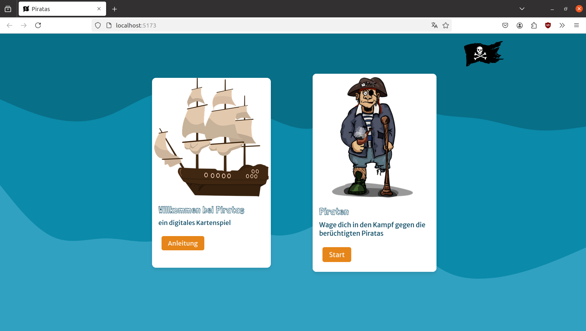
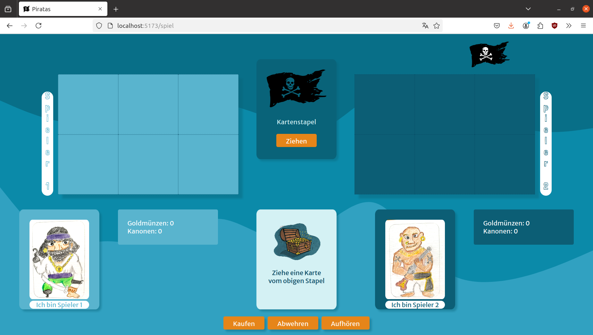
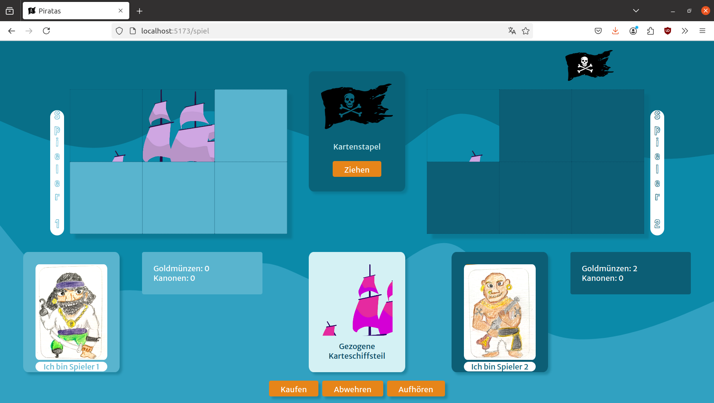

# Ein digitales Kartenspiel "Piratas" 

 In dieser WebApp namens Piratas kann man ein Kartenspiel digital spielen.
 Das Kartenspiel ist ein digitaler Clone des Kartenspiels "Piratatak" von Djeco von den Authoren/Designern Grégory Kirszbaum & Alex Sanders.
 Das Kartendesign und die Anleitung des analogen Spiels sind Vorlage dieses Projekts - Siehe auch [Piratatak](https://youtu.be/bbb5B-n3SrE)






## Technologien

- **Demo Backend**
  - Node + Express

- **Frontend:**
  - React + Vite [¹]
  - React Router
    


## To do 
- code säubern, aufräumen, sortieren !!! 
- Spieler1 und 2 auslagern
- addChangeHandler korrigieren und Schiffteile 

## Projektstruktur

```
basic-router/
│      
├── src/
│   ├── assets/
│   ├── components/
│   │   ├── Header.jsx
│   │   ├── PCard.jsx
│   |   └── SCard.jsx
|   ├── routes/
│   │   ├── Anleitung.jsx
│   │   ├── Landing.jsx
│   │   ├── RootLayout.jsx
│   |   └── Spielfeld.jsx
|   |
|   ├── styles/
│   │   ├── Anleitung.module.css
│   │   ├── Button.module.css
│   │   ├── Card.module.css
│   │   ├── Header.module.css
│   │   ├── Landing.module.css
│   |   └── Modal.module.css
|   |
|   |
|   ├── index.css
|   └── main.jsx
|
├── eslint.config.js
├── index.html
├── package.json
├── README.md
└── vite.config.js
```


## Installation

Installiere die Abhängigkeiten für das Frontend:

- Frontend:

     ```bash
     npm install react-router-dom 
     ```

## Frontend

### Starten der Anwendung

1. Starte die React Entwicklungsumgebung:
   
   ```bash
   npm run dev
   ```
## Verwendung

Nach dem Start des Frontend-Servers kannst du die Piratas App im Browser unter `http://localhost:5173` aufrufen.

<br/>
<br/>
<br/>
-----------------------------------------------------------------------------------

[¹] This template provides a minimal setup to get React working in Vite with HMR and some ESLint rules.

Currently, two official plugins are available:

- [@vitejs/plugin-react](https://github.com/vitejs/vite-plugin-react/blob/main/packages/plugin-react/README.md) uses [Babel](https://babeljs.io/) for Fast Refresh
- [@vitejs/plugin-react-swc](https://github.com/vitejs/vite-plugin-react-swc) uses [SWC](https://swc.rs/) for Fast Refresh


